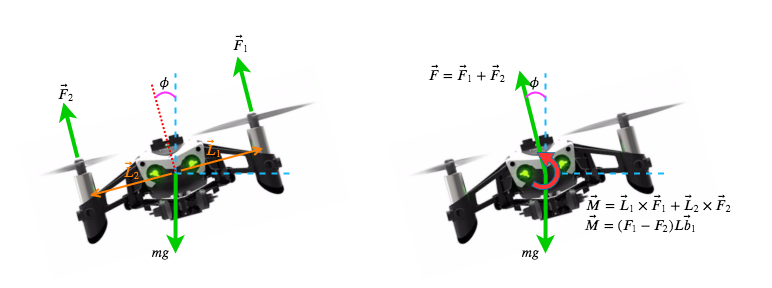
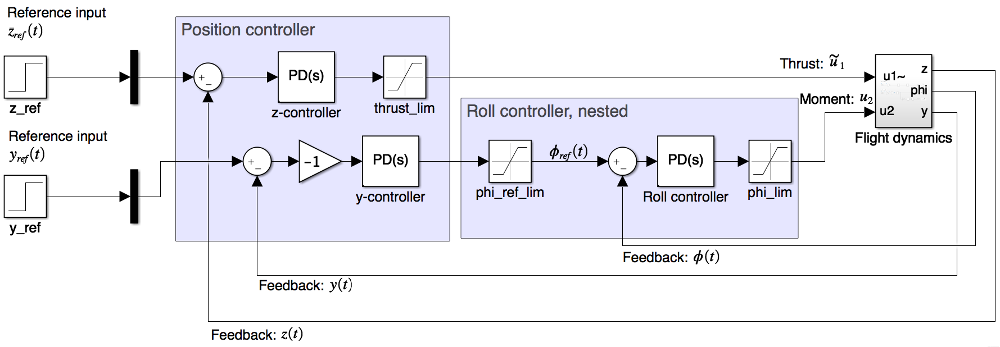
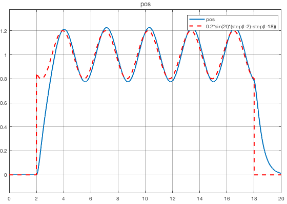

# Quadrotor: Dynamic Systems and Control :rocket:
This repo contains the report and project files for the quadrotor control project.
The project is dynamic modeling of quadrotor physics, and design, implementation and test of flight controllers.

This was an optional project for the course E4DSE (Dynamiske Systemer og Regulering - Dynamic Systems and Control).

The project uses methods from classical and modern control, leveraging linear algebra throughout.

Some samples from the project...

### Quadrotor physics

### Flight controller for two dimensions

### Simulation of non-linear flight dynamics along a sinusoidal path

The pdf file contains the main report, documenting the methods, the math, the results and learnings/future improvements.
Various code and scripts are in the *src* folder.
`.slx` files are Simulink files for simulation of the linear and nonlinear system in various dimensions.
